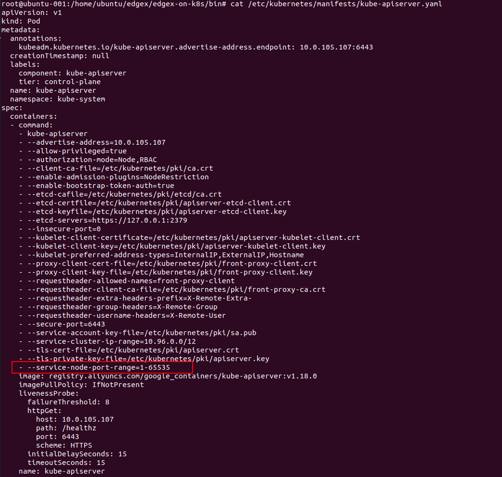
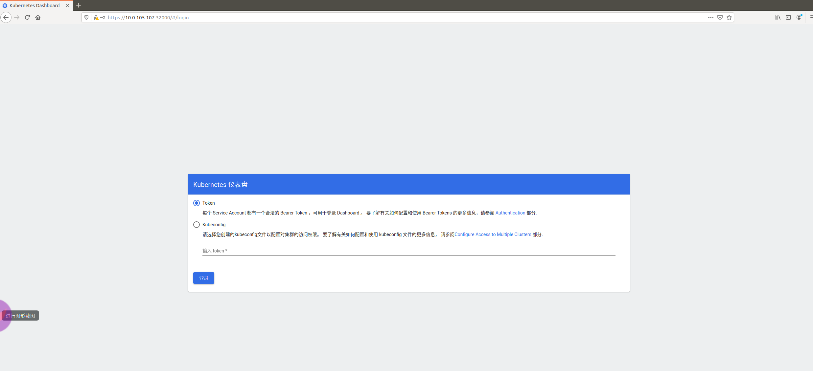
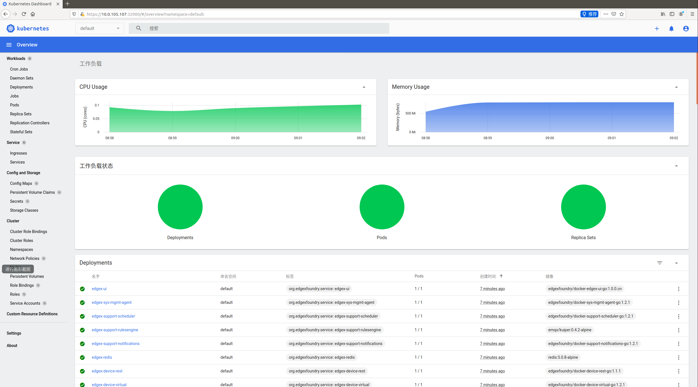
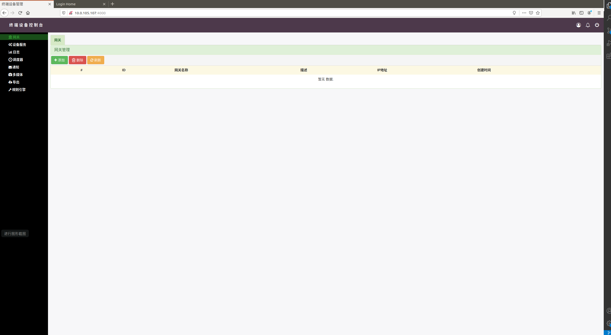

# 目标：该仓库指导部署edgex在kubernetes集群上(包括部署kubernetes-dashboard)

1、[docker-ce安装:使用阿里云镜像](https://developer.aliyun.com/mirror/docker-ce)

2、[kubernetes install on Centos 8.1](kubernetes_install_on_centos.md)

3、[kubernetes install on Ubuntu 19.10](kubernetes_install_on_ubuntu.md)

4、k8S集群搭建完成后，修改K8S master节点上/etc/kubernetes/manifests/kube-apiserver.yaml，增加如下一行：

```
- --service-node-port-range=1-65535
```



# 使用方法

1、下载该仓库，git clone

2、执行kubectl apply -f kubernetes-dashboard/

3、执行kubectl apply -f geneva/


# 部署示例
```
root@ubuntu-001:/home/ubuntu# git clone https://gitee.com/yushanjin/edgex-on-kubernetes.git
Cloning into 'edgex-on-kubernetes'...
remote: Enumerating objects: 67, done.
remote: Counting objects: 100% (67/67), done.
remote: Compressing objects: 100% (67/67), done.
remote: Total 67 (delta 34), reused 0 (delta 0), pack-reused 0
Unpacking objects: 100% (67/67), done.

root@ubuntu-001:~# cd edgex-on-kubernetes
root@ubuntu-001:/home/ubuntu/edgex-on-kubernetes# kubectl apply -f kubernetes-dashboard/
namespace/kubernetes-dashboard created
serviceaccount/kubernetes-dashboard created
service/kubernetes-dashboard created
secret/kubernetes-dashboard-certs created
secret/kubernetes-dashboard-csrf created
secret/kubernetes-dashboard-key-holder created
configmap/kubernetes-dashboard-settings created
role.rbac.authorization.k8s.io/kubernetes-dashboard created
clusterrole.rbac.authorization.k8s.io/kubernetes-dashboard created
rolebinding.rbac.authorization.k8s.io/kubernetes-dashboard created
clusterrolebinding.rbac.authorization.k8s.io/kubernetes-dashboard created
deployment.apps/kubernetes-dashboard created
service/dashboard-metrics-scraper created
deployment.apps/dashboard-metrics-scraper created
clusterrole.rbac.authorization.k8s.io/system:aggregated-metrics-reader created
clusterrolebinding.rbac.authorization.k8s.io/metrics-server:system:auth-delegator created
rolebinding.rbac.authorization.k8s.io/metrics-server-auth-reader created
apiservice.apiregistration.k8s.io/v1beta1.metrics.k8s.io created
serviceaccount/metrics-server created
deployment.apps/metrics-server created
service/metrics-server created
clusterrole.rbac.authorization.k8s.io/system:metrics-server created
clusterrolebinding.rbac.authorization.k8s.io/system:metrics-server created

root@ubuntu-001:/home/ubuntu/edgex-on-kubernetes# kubectl get pod --all-namespaces -o wide
NAMESPACE              NAME                                         READY   STATUS    RESTARTS   AGE    IP             NODE         NOMINATED NODE   READINESS GATES
kube-system            coredns-7ff77c879f-hc9zv                     1/1     Running   7          44d    10.244.0.108   ubuntu-001   <none>           <none>
kube-system            coredns-7ff77c879f-rkng7                     1/1     Running   7          44d    10.244.0.105   ubuntu-001   <none>           <none>
kube-system            etcd-ubuntu-001                              1/1     Running   13         129d   10.0.105.107   ubuntu-001   <none>           <none>
kube-system            kube-apiserver-ubuntu-001                    1/1     Running   13         86d    10.0.105.107   ubuntu-001   <none>           <none>
kube-system            kube-controller-manager-ubuntu-001           1/1     Running   14         129d   10.0.105.107   ubuntu-001   <none>           <none>
kube-system            kube-flannel-ds-amd64-64p5w                  1/1     Running   9          45d    10.0.105.107   ubuntu-001   <none>           <none>
kube-system            kube-proxy-n9gtd                             1/1     Running   4          18d    10.0.105.107   ubuntu-001   <none>           <none>
kube-system            kube-scheduler-ubuntu-001                    1/1     Running   36         41d    10.0.105.107   ubuntu-001   <none>           <none>
kube-system            metrics-server-748845d775-9m44h              1/1     Running   0          39s    10.244.0.116   ubuntu-001   <none>           <none>
kubernetes-dashboard   dashboard-metrics-scraper-6b4884c9d5-6c4dj   1/1     Running   0          40s    10.244.0.115   ubuntu-001   <none>           <none>
kubernetes-dashboard   kubernetes-dashboard-7d8574ffd9-pr7zf        1/1     Running   0          41s    10.244.0.114   ubuntu-001   <none>           <none>

root@ubuntu-001:/home/ubuntu/edgex-on-kubernetes# kubectl apply -f geneva/
service/edgex-app-service-configurable-rules created
deployment.apps/edgex-app-service-configurable-rules created
configmap/edgex-common-variables created
service/edgex-core-command created
deployment.apps/edgex-core-command created
service/edgex-core-consul created
deployment.apps/edgex-core-consul created
service/edgex-core-data created
deployment.apps/edgex-core-data created
service/edgex-core-metadata created
deployment.apps/edgex-core-metadata created
service/edgex-device-rest created
service/edgex-device-virtual created
deployment.apps/edgex-device-rest created
deployment.apps/edgex-device-virtual created
persistentvolume/edgex-consul-config-volume unchanged
persistentvolume/edgex-consul-data-volume unchanged
persistentvolume/edgex-db-volume unchanged
persistentvolumeclaim/consul-config unchanged
persistentvolumeclaim/consul-data unchanged
persistentvolumeclaim/db-data unchanged
service/edgex-redis created
deployment.apps/edgex-redis created
service/edgex-support-notifications created
deployment.apps/edgex-support-notifications created
service/edgex-support-rulesengine created
deployment.apps/edgex-support-rulesengine created
service/edgex-support-scheduler created
deployment.apps/edgex-support-scheduler created
service/edgex-sys-mgmt-agent created
deployment.apps/edgex-sys-mgmt-agent created
service/edgex-ui created
deployment.apps/edgex-ui created

root@ubuntu-001:/home/ubuntu/edgex-on-kubernetes# kubectl get pod --all-namespaces -o wide
NAMESPACE              NAME                                                    READY   STATUS    RESTARTS   AGE     IP             NODE         NOMINATED NODE   READINESS GATES
default                edgex-app-service-configurable-rules-586ff99f44-lm5gh   1/1     Running   1          58s     10.244.0.117   ubuntu-001   <none>           <none>
default                edgex-core-command-67956dd6d6-hlm7r                     1/1     Running   0          58s     10.244.0.118   ubuntu-001   <none>           <none>
default                edgex-core-consul-59d864564f-dzf87                      1/1     Running   0          57s     10.244.0.119   ubuntu-001   <none>           <none>
default                edgex-core-data-6fb8d44648-twpj7                        1/1     Running   0          57s     10.244.0.120   ubuntu-001   <none>           <none>
default                edgex-core-metadata-8ccc6cd4f-vsxsj                     1/1     Running   0          56s     10.244.0.121   ubuntu-001   <none>           <none>
default                edgex-device-rest-9b7d8cf5-xpc5x                        1/1     Running   1          55s     10.244.0.123   ubuntu-001   <none>           <none>
default                edgex-device-virtual-868d446d8-phrkt                    1/1     Running   1          55s     10.244.0.122   ubuntu-001   <none>           <none>
default                edgex-redis-6bccf5d9c-kf928                             1/1     Running   0          53s     10.244.0.124   ubuntu-001   <none>           <none>
default                edgex-support-notifications-694f86569-242xp             1/1     Running   0          52s     10.244.0.125   ubuntu-001   <none>           <none>
default                edgex-support-rulesengine-6b7776b8f5-5cc6t              1/1     Running   0          51s     10.244.0.126   ubuntu-001   <none>           <none>
default                edgex-support-scheduler-685df9fcbf-tvf6z                1/1     Running   0          50s     10.244.0.127   ubuntu-001   <none>           <none>
default                edgex-sys-mgmt-agent-7866d66ddb-8ncqp                   1/1     Running   0          50s     10.244.0.129   ubuntu-001   <none>           <none>
default                edgex-ui-7c95ccd5-f4qcv                                 1/1     Running   0          48s     10.244.0.128   ubuntu-001   <none>           <none>
kube-system            coredns-7ff77c879f-hc9zv                                1/1     Running   7          44d     10.244.0.108   ubuntu-001   <none>           <none>
kube-system            coredns-7ff77c879f-rkng7                                1/1     Running   7          44d     10.244.0.105   ubuntu-001   <none>           <none>
kube-system            etcd-ubuntu-001                                         1/1     Running   13         129d    10.0.105.107   ubuntu-001   <none>           <none>
kube-system            kube-apiserver-ubuntu-001                               1/1     Running   13         86d     10.0.105.107   ubuntu-001   <none>           <none>
kube-system            kube-controller-manager-ubuntu-001                      1/1     Running   14         129d    10.0.105.107   ubuntu-001   <none>           <none>
kube-system            kube-flannel-ds-amd64-64p5w                             1/1     Running   9          45d     10.0.105.107   ubuntu-001   <none>           <none>
kube-system            kube-proxy-n9gtd                                        1/1     Running   4          18d     10.0.105.107   ubuntu-001   <none>           <none>
kube-system            kube-scheduler-ubuntu-001                               1/1     Running   36         41d     10.0.105.107   ubuntu-001   <none>           <none>
kube-system            metrics-server-748845d775-9m44h                         1/1     Running   0          2m59s   10.244.0.116   ubuntu-001   <none>           <none>
kubernetes-dashboard   dashboard-metrics-scraper-6b4884c9d5-6c4dj              1/1     Running   0          3m      10.244.0.115   ubuntu-001   <none>           <none>
kubernetes-dashboard   kubernetes-dashboard-7d8574ffd9-pr7zf                   1/1     Running   0          3m1s    10.244.0.114   ubuntu-001   <none>           <none>

```

# 登录kubernetes-dashboard

```
root@ubuntu-001:/home/ubuntu/edgex-on-kubernetes# kubectl get svc --all-namespaces
NAMESPACE              NAME                                   TYPE        CLUSTER-IP       EXTERNAL-IP   PORT(S)                         AGE
default                edgex-app-service-configurable-rules   NodePort    10.108.219.156   <none>        48100:48100/TCP                 2m42s
default                edgex-core-command                     NodePort    10.110.159.66    <none>        48082:48082/TCP                 2m42s
default                edgex-core-consul                      NodePort    10.98.249.36     <none>        8400:8400/TCP,8500:8500/TCP     2m41s
default                edgex-core-data                        NodePort    10.104.210.34    <none>        48080:48080/TCP,5563:5563/TCP   2m41s
default                edgex-core-metadata                    NodePort    10.104.207.23    <none>        48081:48081/TCP                 2m40s
default                edgex-device-rest                      NodePort    10.105.61.109    <none>        49986:49986/TCP                 2m39s
default                edgex-device-virtual                   NodePort    10.108.191.207   <none>        49990:49990/TCP                 2m39s
default                edgex-redis                            NodePort    10.103.226.200   <none>        6379:6379/TCP                   2m37s
default                edgex-support-notifications            NodePort    10.99.3.11       <none>        48060:48060/TCP                 2m37s
default                edgex-support-rulesengine              NodePort    10.96.169.3      <none>        48075:48075/TCP                 2m36s
default                edgex-support-scheduler                NodePort    10.108.209.158   <none>        48085:48085/TCP                 2m35s
default                edgex-sys-mgmt-agent                   NodePort    10.105.244.152   <none>        48090:48090/TCP                 2m34s
default                edgex-ui                               NodePort    10.110.192.59    <none>        4000:4000/TCP                   2m33s
default                kubernetes                             ClusterIP   10.96.0.1        <none>        443/TCP                         129d
kube-system            kube-dns                               ClusterIP   10.96.0.10       <none>        53/UDP,53/TCP,9153/TCP          129d
kube-system            metrics-server                         ClusterIP   10.104.124.71    <none>        443/TCP                         4m43s
kubernetes-dashboard   dashboard-metrics-scraper              ClusterIP   10.101.170.135   <none>        8000/TCP                        4m44s
kubernetes-dashboard   kubernetes-dashboard                   NodePort    10.98.74.103     <none>        443:32000/TCP                   4m45s

root@ubuntu-001:/home/ubuntu/edgex-on-kubernetes# kubectl -n kubernetes-dashboard get secret $(kubectl -n kubernetes-dashboard get secret | grep kubernetes-dashboard-token | awk '{print $1}') -o jsonpath='{.data.token}' | base64 -d
eyJhbGciOiJSUzI1NiIsImtpZCI6Imk5bWEtTmlxRUJDVGZkUTNlMGprYkw4dklOSF9oNE1EMGRTWDNCbFVkVFUifQ.eyJpc3MiOiJrdWJlcm5ldGVzL3NlcnZpY2VhY2NvdW50Iiwia3ViZXJuZXRlcy5pby9zZXJ2aWNlYWNjb3VudC9uYW1lc3BhY2UiOiJrdWJlcm5ldGVzLWRhc2hib2FyZCIsImt1YmVybmV0ZXMuaW8vc2VydmljZWFjY291bnQvc2VjcmV0Lm5hbWUiOiJrdWJlcm5ldGVzLWRhc2hib2FyZC10b2tlbi1rdDg3cyIsImt1YmVybmV0ZXMuaW8vc2VydmljZWFjY291bnQvc2VydmljZS1hY2NvdW50Lm5hbWUiOiJrdWJlcm5ldGVzLWRhc2hib2FyZCIsImt1YmVybmV0ZXMuaW8vc2VydmljZWFjY291bnQvc2VydmljZS1hY2NvdW50LnVpZCI6ImIwYzk0ZWFjLTg4ZGYtNDU3NC1hMjliLTk2Nzc2MGYzZmQwOSIsInN1YiI6InN5c3RlbTpzZXJ2aWNlYWNjb3VudDprdWJlcm5ldGVzLWRhc2hib2FyZDprdWJlcm5ldGVzLWRhc2hib2FyZCJ9.N2pWrlhz3dN1e4J74O30RyVk_jN0mV7mfXPwIuZ8fc2KepRgvEbhCA8x88OQ22YKEuaaZEu5C9r1fSkVLcMEGJhncSQmzwIy68nw21xj4V1DYPuCpHBqkV91Q0i8E2-iylxTli8_fmIb89UIEh-S4H82xvoQowy-rknEgpQs6NwVOogiKy78_4vhoB30wz0rF227xp7nNUy6BcUMbKHKfBWXuWnA5VtRHIiXSK115G5GlLMureKLeILEVX-qNcFH9Y3A6i61nqPLdAQTdKFI3fqos7jrV_n4OfAIVOrIZMUxlIPrYlzQmUQdbuIwDMQrf98ZKiHkeke3NeJuAjg4Pg
```





# 登录edgex ui（admin/admin）

